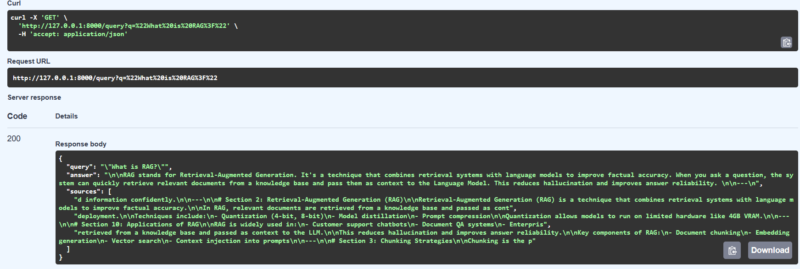

# 🚀 Hybrid RAG System
### FastAPI • FAISS • BM25 • Reranking • Ollama (Phi)

<p align="center">
  
  
  
  
  
</p>

---

## 🧠 Overview

This project implements a **production-grade Retrieval-Augmented Generation (RAG) system** designed for:

- ⚡ High accuracy (hybrid retrieval + reranking)
- 💻 Low-resource environments (4GB VRAM)
- 🧪 Interview-ready system design demonstration

---

## 🏗️ System Architecture

```
User Query
   ↓
Hybrid Retriever (BM25 + FAISS)
   ↓
Top-K Results
   ↓
Cross-Encoder Reranker
   ↓
Top Context
   ↓
LLM (Ollama - Phi)
   ↓
Final Answer
```

---

## ⚙️ Key Features

- 🔍 Hybrid Search (BM25 + Dense Embeddings)
- ⚡ FAISS for fast vector similarity
- 🎯 Cross-encoder reranking (precision boost)
- ✂️ Recursive chunking with overlap
- 🧠 Context-grounded prompting (anti-hallucination)
- 🏃 FastAPI backend
- 🧪 Evaluation metrics (Recall + Hallucination)
- 💻 Runs on local machine (no cloud required)

---

## 📂 Project Structure

```
.
├── app.py
├── retriever.py
├── reranker.py
├── embedder.py
├── chunking.py
├── llm.py
├── eval.py
├── data/
│   └── docs.txt
```

---

## 🔬 Core Innovations

### 1. Hybrid Retrieval
Combines:
- BM25 → keyword precision
- FAISS → semantic similarity

➡️ Result: **Higher Recall than standalone methods**

---

### 2. Cross-Encoder Reranking
- Scores query-document pairs
- Improves relevance ranking

➡️ Result: **Higher Precision**

---

### 3. Prompt Grounding
```
"You must answer ONLY from the context"
```

➡️ Result: **Reduced hallucination**

---

### 4. Low-VRAM Optimization
- Lightweight embedding model
- Local LLM (Phi via Ollama)

➡️ Runs efficiently on **4GB VRAM**

---

## 🚀 Getting Started


### 1. Install Dependencies
```bash
pip install fastapi uvicorn sentence-transformers faiss-cpu rank-bm25 numpy requests
```

### 2. Start Ollama
```bash
ollama run phi
```

### 3. Run API
```bash
uvicorn app:app --reload
```

### 4. Test Query
```
http://localhost:8000/query?q=What is RAG?
```

---

## 📊 Example Output

```json
{
  "query": "What is RAG?",
  "answer": "RAG is a technique that combines retrieval with generation...",
  "sources": ["doc1", "doc2", "doc3"]
}
```
---

## 📸 Demo



---

## 🧪 Evaluation Metrics

| Metric | Purpose |
|------|--------|
| Recall@k | Retrieval quality |
| Hallucination Check | Grounding validation |

---

## 📈 Benchmark Ideas

You can extend this project with:

| Model | Latency | VRAM | Quality |
|------|--------|------|--------|
| Phi | Fast | Low | Medium |
| TinyLlama | Faster | Very Low | Lower |
| Mistral | Slower | Higher | Better |

---

## 📌 Future Improvements

- Streaming responses
- KV cache optimization
- LLM-as-judge evaluation
- Frontend dashboard
- Multi-document ingestion
- Semantic chunking

---

## 💡 Use Cases

- Enterprise search
- Document QA
- Chatbots
- Knowledge assistants

---

## ⭐ Support

If you found this useful:
- ⭐ Star this repo
- 🍴 Fork it


---

